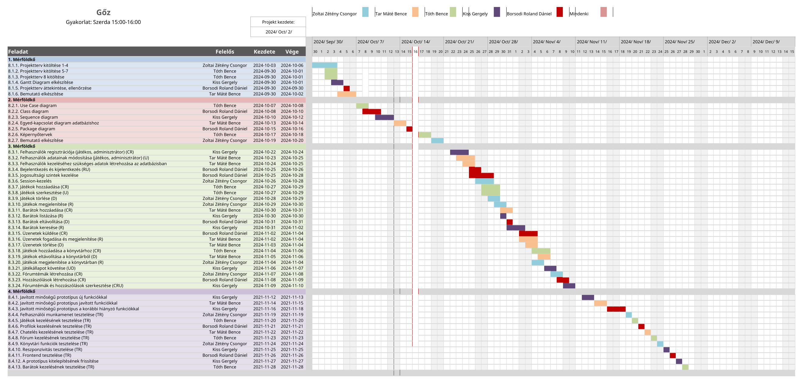

# Gőz Projektterv 2024

## 1. Összefoglaló 

A weboldal célja, hogy átfogó képet nyújtson egy online videojáték-platform működéséről. Itt a felhasználók nemcsak játékokat vásárolhatnak meg, hanem lehetőségük nyílik a digitális tartalmak egyszerű letöltésére és telepítésére is. A platformon különféle játékok széles választéka áll rendelkezésre, így mindenki megtalálhatja a számára legmegfelelőbb szórakozást. Emellett a felhasználók közösségi funkciókat is igénybe vehetnek, mint például a barátok hozzáadása, a csevegés, valamint multiplayer játékok megszervezése, amelyek elősegítik az online interakciót és a közös játékélményeket.

## 2. A projekt bemutatása

Ez a projektterv a Gőz nevű projekt részleteit ismerteti, amely 2024. október 2-tól 2024. december 2-ig, tehát összesen 61 napon át fog tartani. A projektet egy ötfős fejlesztői csapat fogja kivitelezni. A feladatok elvégzését négy alkalommal fogjuk bemutatni az ügyfélnek, hogy biztosítsuk a projekt folyamatos haladását és a megrendelő igényeinek megfelelően haladjunk.

### 2.1. Rendszerspecifikáció

A kész webalkalmazásnak tudnia kell kezelni felhasználói profilokat, minden játékos könyvtárát, amihez tudnia kell hozzáadni játékokat amiket az áruházban tud megvásárolni. Az oldalon a regisztrált felhasználók tudnak barátokat hozzáadni a barátlistájukhoz, velük interaktálni, chatelni. Az adminisztrátorok képesek hozzáadni játékokat, kitilthatnak felhasználókat, moderálhatják a felhasználók közösségi profilját. 

### 2.2. Funkcionális követelmények
#### Felhasználók: userID, username, email, password, role, profilePicture

#### Felhasználók kezelése (admin, játékos) (CRUD)
 - Felhasználók regisztrációja: Új felhasználók létrehozása (admin és játékos szerepkörrel).
 - Felhasználók adatainak módosítása: A felhasználók profiljának szerkesztése (név, email, jelszó, stb.).
 - Felhasználók törlése: Adminisztrátorok által felhasználók törlése.
 - Felhasználók listázása: Felhasználók megjelenítése különböző szűrőkkel és keresési lehetőségekkel.
#### Felhasználói munkamenet megvalósítása több jogosultsági szinttel
 - Bejelentkezés és kijelentkezés: Felhasználói autentikáció kezelése.
 - Jogosultsági szintek kezelése: Jogosultságok adminisztrátorok és játékosok számára.
 - Session-kezelés: Munkamenetek figyelése és kezelése (cookie-k, tokenek, stb.).   

#### Játékok: gameID, title, description, category
#### Játékok kezelése (CRUD)
 - Játékok hozzáadása: Új játékok létrehozása (admin felhasználók számára).
 - Játékok szerkesztése: Játékok adatainak módosítása (pl. cím, leírás, kategória).
 - Játékok törlése: Nem kívánt játékok eltávolítása az adatbázisból.
 - Játékok megjelenítése: Játékok listázása és keresése a felhasználók számára.   
#### Barátság kapcsolat: status
#### Barátok kezelése (CRUD)
 - Barátok hozzáadása: Felhasználók barátlistájának kezelése (felhasználók meghívása).
 - Barátok listázása: Jelenlegi barátok listázása és megjelenítése.
 - Barátok eltávolítása: Baráti kapcsolatok megszüntetése.
 - Barátok keresése: Felhasználók közötti keresés és javaslattételek a barátlistába.   
#### Üzenet: messageID, senderID, receiverID, sentAt, content
#### Üzenetek kezelése (CRUD)
 - Üzenetek küldése: Privát üzenetküldés felhasználók között.
 - Üzenetek fogadása és megjelenítése: Bejövő üzenetek megjelenítése.
 - Üzenetek törlése: Üzenetek eltávolítása a felhasználói felületről.
 - Üzenetek listázása: Felhasználók által küldött és fogadott üzenetek megjelenítése.   
#### Játék Könyvtár: libraryID, gameID, userID
#### Felhasználók játékkönyvtárának kezelése (CRUD)
 - Játékok hozzáadása a könyvtárhoz: Felhasználók játéklistájának szerkesztése.
 - Játékok eltávolítása a könyvtárból: Nem kívánt játékok törlése a felhasználók saját könyvtárából.
 - Játékok megjelenítése a könyvtárban: Játékok megjelenítése és kategorizálása.
 - Játékállapot követése: Játékok állapotának (pl. "játszott", "befejezett") frissítése.   
#### Fórum Témák: topicID, gameID, title
#### Fórum Kommentek: commentID, topicID, userID, createdAt, content
#### Fórumok kezelése (CRUD)
 - Fórumtémák létrehozása: Új témák indítása különböző játékokkal vagy problémákkal kapcsolatban.
 - Hozzászólások létrehozása: Felhasználók hozzászólásai fórumtémákhoz.
 - Fórumtémák és hozzászólások szerkesztése: Témák és hozzászólások módosítása (admin jogok).
 - Fórumtémák törlése: Nem releváns vagy szabálysértő tartalmak eltávolítása.

### 2.3. Nem funkcionális követelmények

 - A kliens oldal böngészőfüggetlen legyen
 - Reszponzív megjelenés
 - Az érzékeny adatokat biztonságosan tároljuk
 - A legfrissebb technológiákat használja a rendszer

## 3. Költség- és erőforrás-szükségletek

Az erőforrásigényünk összesen 65 személynap, átlagosan 13 személynap/fő.

A rendelkezésünkre áll összesen 5 * 70 = 350 pont.

## 4. Szervezeti felépítés és felelősségmegosztás

A projekt megrendelője Dr. Pflanzner Tamás. A Gőz projektet a projektcsapat fogja végrehajtani, amely jelenleg öt fejlesztőből áll. A csapatban főként kezdő webprogramozók találhatóak, de mindenkinek van már tapasztalata a webfejlesztésben.
 - Zoltai Zétény Csongor (1 év egyetemi tapasztalat)
 - Borsodi Roland Dániel (1 év egyetemi tapasztalat)
 - Kiss Gergely (1 év egyetemi tapasztalat)
 - Tar Máté Bence (1 év egyetemi tapasztalat)
 - Tóth Bence (1 év egyetemi tapasztalat)

### 4.1 Projektcsapat

A projekt a következő emberekből áll:

| Név                         | Pozíció           |  E-mail cím (stud-os)       |
|-----------------------------|-------------------|-----------------------------|
| Zoltai Zétény Csongor       | Projektmenedzser  | h379982@stud.u-szeged.hu    |
| Borsodi Roland Dániel       | Projekt tag       | h348697@stud.u-szeged.hu    |
| Kiss Gergely                | Projekt tag       | h366478@stud.u-szeged.hu    |
| Tar Máté Bence              | Projekt tag       | h378371@stud.u-szeged.hu    |
| Tóth Bence                  | Projekt tag       | h378616@stud.u-szeged.hu    |

## 5. A munka feltételei

### 5.1. Munkakörnyezet

A projekt a következő munkaállomásokat fogja használni a munka során:

 - Munkaállomások: 5 db, Windows 11-es és Ubuntu Linux operációs rendszerrel
 - Dell Inspiron 13 5730 laptop (CPU: i5 8265U, RAM: 8 GB, GPU: Intel Hd 620) Linux Mint
 - Asztali számítógép (CPU: AMD Ryzen 5 5700X, RAM: 32 GB, GPU: AMD Radeon RX 6800XT) Windows 11
 - Asztali számítógép (CPU: AMD Ryzen 5 7600X, RAM: 32 GB, GPU: Nvidia RTX 4070) Windows 11
 - Asztali számítógép (CPU: i5 12400F, RAM: 24GB, GPU: AMD Radeon RX 6600XT) Windows 11
 - MSI Katana GF66 11UE (CPU: i5 11400H, RAM: 32GB, GPU: Nvidia RTX 3060M) Windows 11
 - HP 255 G9 (CPU: Ryzen 5 5625U, RAM: 8GB, GPU: AMD Radeon Integrated) Windows 11

A projekt a következő technológiákat/szoftvereket fogja használni a munka során: 

 - Host: Hekoru
 - Frontend: eJs/React Js
 - Backend: Node JS
 - JetBrains fejlesztőkörnyezet
 - VS Code fejlesztőkörnyezet
 - Git verziókövető (GitLab)

### 5.2. Rizikómenedzsment

| Kockázat                                    | Leírás                                                                                                                                                                                     | Valószínűség | Hatás  |
|---------------------------------------------|--------------------------------------------------------------------------------------------------------------------------------------------------------------------------------------------|--------------|--------|
| Betegség                                  | Súlyosságtól függően hátráltatja vagy bizonyos esetekben teljes mértékben korlátozza a munkavégzőt, így az egész projektre kihatással van. Megoldás: a feladatok átcsoportosítása        | nagy       | erős |
| Kommunikációs fennakadás a csapattagokkal | A csapattagok között nem elégséges az információ áramlás, nem pontosan, esetleg késve vagy nem egyértelműen tájékoztatjuk egymást. Megoldás: még gyakoribb megbeszélések és ellenőrzések | kis        | erős |
| Műszaki meghibásodás | A projekt elkészítéséhez szükséges informatikai eszköz meghibásodása. Megoldás: Szervizelés | kis        | erős |
| Rossz időbeosztás | A projektmunka elhanyagolása, ezzel az egész csapat hátráltatása. Megoldás: több megbeszélés, helyzetjelentés | nagy        | erős |
| Hivatalos ügyintézés | kötelező megjelenéses program miatt elhagyagolásra kerül a projektmunka | kis        | erős |
| Adatvesztés | Figyelemhiány miatt a projekthez fontos adatok elvesztése | nagy        | erős |
| Internet kiesés | Az internetszolgáltatás elérhetősége miatt projektmunka akadályozása | nagy        | erős |

## 6. Jelentések

### 6.1. Munka menedzsment
A munkát Zoltai Zétény Csongor koordinálja. A fő feladata, hogy rendszeresen egyeztessen a csapattagokkal az előrehaladásról, valamint a felmerülő problémákról. Ezen túlmenően szükség esetén segítséget nyújthat a problémák megoldásában annak érdekében, hogy elkerüljék a projekt csúszását. Továbbá, feladata a heti csoportgyűlések időpontjának és helyszínének megszervezése, majd ezekről e-mailben tájékoztatja a projektcsapatot.

### 6.2. Csoportgyűlések

A projekt heti rendszerességgel tart megbeszéléseket, ahol áttekintik az előző hét során felmerült problémákat, valamint megvitatják a következő hét feladatait. A megbeszélésekről minden alkalommal emlékeztető készül.

1. megbeszélés:
 - Időpont: 2021.09.11.
 - Hely: Discord
 - Résztvevők: Mindenki
 - Érintett témák: Ismerkedés, projekttéma kiválasztása

2. megbeszélés:
 - Időpont: 2021.10.02.
 - Hely: Discord
 - Résztvevők: Mindenki
 - Érintett témák: A projektben használt technológiák rögzítése, a projektterv áttekintése szerepkörök és vállalások kiosztása

### 6.3. Minőségbiztosítás

Az elkészült terveket a terveken nem dolgozó csapattársak közül átnézik, hogy megfelel-e a specifikációnak és az egyes diagramtípusok összhangban vannak-e egymással. A meglévő rendszerünk helyes működését a prototípusok bemutatása előtt a tesztelési dokumentumban leírtak végrehajtása alapján ellenőrizzük és összevetjük a specifikációval, hogy az elvárt eredményt kapjuk-e. További tesztelési lehetőségek: unit tesztek írása az egyes modulokhoz vagy a kód közös átnézése (code review) egy, a vizsgált modul programozásában nem résztvevő csapattaggal. Szoftverünk minőségét a végső leadás előtt javítani kell a rendszerünkre lefuttatott kódelemzés során kapott metrikaértékek és szabálysértések figyelembevételével.
Az alábbi lehetőségek vannak a szoftver megfelelő minőségének biztosítására:
- Specifikáció és tervek átnézése (kötelező)
- Teszttervek végrehajtása (kötelező)
- Unit tesztek írása (választható)
- Kód átnézése (választható)

### 6.4. Átadás, eredmények elfogadása

A projekt eredményeit a megrendelő, Dr. Pflanzner Tamás fogja elfogadni. A projektterven változásokat csak a megrendelő írásos engedélyével lehet tenni. A projekt eredményesnek bizonyul, ha specifikáció helyes és határidőn belül készül el. Az esetleges késések pontlevonást eredményeznek. 
Az elfogadás feltételeire és beadás formájára vonatkozó részletes leírás a következő honlapon olvasható: https://okt.inf.szte.hu/rf1/

### 6.5. Státuszjelentés

Minden mérföldkő leadásnál a projekten dolgozók jelentést tesznek a mérföldkőben végzett munkájukról a a megadott sablon alapján. A gyakorlatvezetővel folytatott csapatmegbeszéléseken a csapat áttekintik és felmérik az eredményeket és teendőket. Továbbá gazdálkodnak az erőforrásokkal és szükség esetén a megrendelővel egyeztetnek a projektterv módosításáról.

## 7. A munka tartalma

### 7.1. Tervezett szoftverfolyamat modell és architektúra

A szoftver fejlesztése során az agilis fejlesztési modellt alkalmazzuk, mivel nagy hangsúlyt helyezünk a folyamatos kommunikációra. Ez a módszertan lehetővé teszi, hogy rugalmasan változtassuk a szoftver specifikációit, és gyorsan alkalmazkodjunk az új elvárásokhoz, így hatékonyan reagálhatunk a fejlesztés közben felmerülő igényekre.

A webalkalmazás az MVC (Model-View-Controller) architektúrát követi, ahol a szerver és a kliens egymástól függetlenül működnek, és kizárólag API végpontokon keresztül kommunikálnak. Ez a megoldás biztosítja a rendszer modularitását és skálázhatóságát, lehetővé téve a különálló komponensek rugalmas fejlesztését.

### 7.2. Átadandók és határidők

A főbb átadandók és határidők a projekt időtartama alatt a következők:

| Szállítandó |                 Neve                                                        |   Határideje  |
|:-----------:|:---------------------------------------------------------------------------:|:-------------:|
|      D1     |      Projektterv és Gantt chart, prezentáció, egyéni jelentés               | 2024-10-07  |
|    P1+D2    |      UML, adatbázis- és képernyőtervek, prezentáció, egyéni jelentés        | 2024-10-21  |
|    P1+D3    |      Prototípus I. és tesztelési dokumentáció, egyéni jelentés              | 2024-11-11  |
|    P2+D4    |      Prototípus II. és frissített tesztelési dokumentáció, egyéni jelentés  | 2024-12-02  |

D - dokumentáció, P - prototípus

## 8. Feladatlista

A következőkben a tervezett feladatok részletes összefoglalása található.

### 8.1. Projektterv (1. mérföldkő)

Ennek a feladatnak az a célja, hogy megvalósításhoz szükséges lépéseket, az erőforrásigényeket, az ütemezést, a felelősöket és a feladatok sorrendjét meghatározzuk, majd vizualizáljuk Gantt diagram segítségével.

Részfeladatai a következők:

#### 8.1.1. Projektterv 1-4 kitöltése

Felelős: Zoltai Zétény Csongor

Tartam:  4 nap

Erőforrásigény:  1 személynap / fő

#### 8.1.2. Projektterv 5-7 kitöltése

Felelős: Tóth Bence

Tartam:  2 nap

Erőforrásigény:  1 személynap / fő

#### 8.1.3. Projektterv 8 kitöltése

Felelős: Tóth Bence

Tartam:  2 nap

Erőforrásigény:  1 személynap / fő

#### 8.1.4. Gantt Diagram elkészítése

Felelős: Kiss Gergely

Tartam:  2 nap

Erőforrásigény:  1 személynap / fő

#### 8.1.5. Projektterv áttekintése, ellenőrzése

Felelős: Borsodi Roland Dániel

Tartam:  1 nap

Erőforrásigény:  1 személynap / fő

#### 8.1.6. Bemutató elkészítése

Felelős: Tar Máté Bence

Tartam:  3 nap

Erőforrásigény:  1 személynap / fő

### 8.2. UML és adatbázis- és képernyőtervek (2. mérföldkő)

Ennek a feladatnak az a célja, hogy a rendszerarchitektúrát, az adatbázist és webalkalmazás kinézetét megtervezzük.

Részfeladatai a következők:

#### 8.2.1. Use Case diagram

Felelős: Tóth Bence

Tartam:  2 nap

Erőforrásigény:  1 személynap

#### 8.2.2. Class diagram

Felelős: Borsodi Roland Dániel

Tartam:  3 nap

Erőforrásigény:  1 személynap

#### 8.2.3. Sequence diagram

Felelős: Kiss Gergely

Tartam:  3 nap

Erőforrásigény:  1 személynap

#### 8.2.4. Egyed-kapcsolat diagram adatbázishoz

Felelős: Tar Máté Bence

Tartam:  2 nap

Erőforrásigény:  1 személynap

#### 8.2.5. Package diagram

Felelős: Zoltai Zétény Csongor

Tartam:  2 nap

Erőforrásigény:  1 személynap

#### 8.2.6. Képernyőtervek

Felelős: Tóth Bence

Tartam:  2 nap

Erőforrásigény:  1 személynap

#### 8.2.7. Bemutató elkészítése

Felelős: Zoltai Zétény Csongor

Tartam:  2 nap

Erőforrásigény:  1 személynap

### 8.3. Prototípus I. (3. mérföldkő)

Ennek a feladatnak az a célja, hogy egy működő prototípust hozzunk létre, ahol a vállalt funkcionális követelmények nagy része már prezentálható állapotban van.

Részfeladatai a következők:

#### 8.3.1. Felhasználók regisztrációja (játékos, adminisztrátor) (CR)

Felelős: Kiss Gergely

Tartam:  3 nap

Erőforrásigény:  2 személynap

#### 8.3.2. Felhasználók adatainak módosítása (játékos, adminisztrátor) (U)

Felelős: Tar Máté Bence

Tartam:  3 nap

Erőforrásigény:  2 személynap

#### 8.3.3. Felhasználók törlése (D)

Felelős: Tar Máté Bence

Tartam:  2 nap

Erőforrásigény:  1 személynap

#### 8.3.4. Bejelentkezés és kijelentkezés (RU)

Felelős: Borsodi Roland Dániel

Tartam:  2 nap

Erőforrásigény:  1 személynap

#### 8.3.5. Jogosultsági szintek kezelése

Felelős: Borsodi Roland Dániel

Tartam:  4 nap

Erőforrásigény:  2 személynap

#### 8.3.6. Session-kezelés

Felelős: Zoltai Zétény Csongor

Tartam:  3 nap

Erőforrásigény:  2 személynap

#### 8.3.7. Játékok hozzáadása (CR)

Felelős: Tóth Bence

Tartam:  3 nap

Erőforrásigény:  2 személynap

#### 8.3.8. Játékok szerkesztése (U)

Felelős: Tóth Bence

Tartam:  3 nap

Erőforrásigény:  2 személynap

#### 8.3.9. Játékok törlése (D)

Felelős: Zoltai Zétény Csongor

Tartam:  2 nap

Erőforrásigény:  2 személynap

#### 8.3.10. Játékok megjelenítése (R)

Felelős: Zoltai Zétény Csongor

Tartam:  2 nap

Erőforrásigény:  1 személynap

#### 8.3.11. Barátok hozzáadása (CR)

Felelős: Tar Máté Bence

Tartam:  2 nap

Erőforrásigény:  1 személynap

#### 8.3.12. Barátok listázása (R)

Felelős: Kiss Gergely

Tartam:  1 nap

Erőforrásigény:  1 személynap

#### 8.3.13. Barátok eltávolítása (D)

Felelős: Borsodi Roland Dániel

Tartam:  1 nap

Erőforrásigény:  1 személynap

#### 8.3.14. Barátok keresése (R)

Felelős: Kiss Gergely

Tartam:  3 nap

Erőforrásigény:  2 személynap

#### 8.3.15. Üzenetek küldése (CR)

Felelős: Borsodi Roland Dániel

Tartam:  3 nap

Erőforrásigény:  2 személynap

#### 8.3.16. Üzenetek fogadása és megjelenítése (R)

Felelős: Tar Máté Bence

Tartam:  3 nap

Erőforrásigény:  2 személynap

#### 8.3.17. Üzenetek törlése (D)

Felelős: Tar Máté Bence

Tartam:  2 nap

Erőforrásigény:  1 személynap

#### 8.3.18. Játékok hozzáadása a könyvtárhoz (CR)

Felelős: Tóth Bence

Tartam:  3 nap

Erőforrásigény:  2 személynap

#### 8.3.19. Játékok eltávolítása a könyvtárból (D)

Felelős: Tar Máté Bence

Tartam:  2 nap

Erőforrásigény:  2 személynap

#### 8.3.20. Játékok megjelenítése a könyvtárban (R)

Felelős: Zoltai Zétény Csongor

Tartam:  1 nap

Erőforrásigény:  2 személynap

#### 8.3.21. Játékállapot követése (UD)

Felelős: Kiss Gergely

Tartam:  2 nap

Erőforrásigény:  2 személynap

#### 8.3.22. Fórumtémák létrehozása (CR)

Felelős: Zoltai Zétény Csongor

Tartam:  2 nap

Erőforrásigény:  2 személynap

#### 8.3.23. Hozzászólások létrehozása (CR)

Felelős: Borsodi Roland Dániel

Tartam:  2 nap

Erőforrásigény:  2 személynap

#### 8.3.24. Fórumtémák és hozzászólások szerkesztése (CRU)

Felelős: Kiss Gergely

Tartam:  2 nap

Erőforrásigény:  2 személynap

### 8.4. Prototípus II. (4. mérföldkő)

Ennek a feladatnak az a célja, hogy az előző mérföldkő hiányzó funkcióit pótoljuk, illetve a hibásan működő funkciókat és az esetlegesen felmerülő új funkciókat megvalósítsuk. Továbbá az alkalmazás alapos tesztelése is a mérföldkőben történik az előző mérföldkőben összeállított tesztesetek alapján.

Részfeladatai a következők:

#### 8.4.1. Javított minőségű prototípus új funkciókkal

Felelős: Kiss Gergely

Tartam:  2 nap

Erőforrásigény:  0.5 személynap

#### 8.4.2. Javított minőségű prototípus javított funkciókkal

Felelős: Tar Máté Bence

Tartam:  2 nap

Erőforrásigény:  1 személynap

#### 8.4.3. Javított minőségű prototípus a korábbi hiányzó funkciókkal

Felelős: Borsodi Roland Dániel

Tartam:  3 nap

Erőforrásigény:  1 személynap

#### 8.4.4. Felhasználói munkamenet tesztelése (TR)

Felelős: Zoltai Zétény Csongor

Tartam:  1 nap

Erőforrásigény:  0.5 személynap

#### 8.4.5. Játékok kezelésének tesztelése (TR)

Felelős: Tóth Bence

Tartam:  1 nap

Erőforrásigény:  1 személynap

#### 8.4.6. Profilok kezelésének tesztelése (TR)

Felelős: Borsodi Roland Dániel

Tartam:  1 nap

Erőforrásigény: 1 személynap

#### 8.4.7. Chatelés kezelésének tesztelése (TR)

Felelős: Tar Máté Bence

Tartam:  1 nap

Erőforrásigény:  1 személynap

#### 8.4.8. Fórum kezelésének tesztelése (TR)

Felelős: Tóth Bence

Tartam:  1 nap

Erőforrásigény:  1 személynap

#### 8.4.9. Könyvtári funkciók tesztelése (TR)

Felelős: Zoltai Zétény Csongor

Tartam: 1 nap

Erőforrásigény:  0.5 személynap

#### 8.4.10. Reszponzivitás tesztelése (TR)

Felelős: Kiss Gergely

Tartam:  1 nap

Erőforrásigény:  0.5 személynap

#### 8.4.11. Frontend tesztelése (TR)

Felelős: Borsodi Roland Dániel

Tartam:  1 nap

Erőforrásigény:  1 személynap

#### 8.4.12. A prototípus kitelepítésének frissítése

Felelős: Kiss Gergely

Tartam:  1 nap

Erőforrásigény:  1 személynap

#### 8.4.13. Barátok kezelésének tesztelése (TR)

Felelős: Tóth Bence

Tartam:  1 nap

Erőforrásigény: 1 személynap

## 9. Részletes időbeosztás

## 10. Projekt költségvetés

### 10.1. Részletes erőforrásigény (személynap)

| Név                   |   M1  |   M2  |   M3 |   M4  | Összesen |
|-----------------------|-------|-------|------|-------|----------|
| Zoltai Zétény Csongor |   1   |   2   |   9  |   1   |    13    |
| Tóth Bence            |   2   |   2   |   6  |   3   |    13    |
| Kiss Gergely          |   1   |   1   |   9  |   2   |    13    |
| Tar Máté Bence        |   1   |   1   |   9  |   2   |    13    |
| Borsodi Roland Dániel |   1   |   1   |   8  |   3   |    13    |

### 10.2. Részletes feladatszámok

| Név                   |   M1  |   M2  |   M3 |   M4  | Összesen |
|-----------------------|-------|-------|------|-------|----------|
| Zoltai Zétény Csongor |   1   |   2   |   5  |   2   |    10    |
| Tóth Bence            |   2   |   2   |   4  |   2   |    10    |
| Kiss Gergely          |   1   |   1   |   5  |   3   |    10    |
| Tar Máté Bence        |   1   |   1   |   6  |   2   |    10    |
| Borsodi Roland Dániel |   1   |   1   |   5  |   3   |    10    |

### 10.3. Részletes költségvetés

| Név                                 | M1      | M2       | M3       | M4       | Összesen  |
|-------------------------------------|---------|----------|----------|----------|-----------|
| Maximálisan megszerezhető pontszám  |  (7)    | (20)     | (35)     |  (28)    | 100% (70) |
| Zoltai Zétény Csongor               |   7     |  10      |  28      |   25     | 70        |
| Tóth Bence                          |   7     |  12      |  26      |   25     | 70        |
| Kiss Gergely                        |   7     |  10      |  24      |   29     | 70        |
| Tar Máté Bence                      |   7     |  10      |  28      |   25     | 70        |
| Borsodi Roland Dániel               |   7     |  12      |  24      |   27     | 70        |

Szeged, 2024-10-04.
